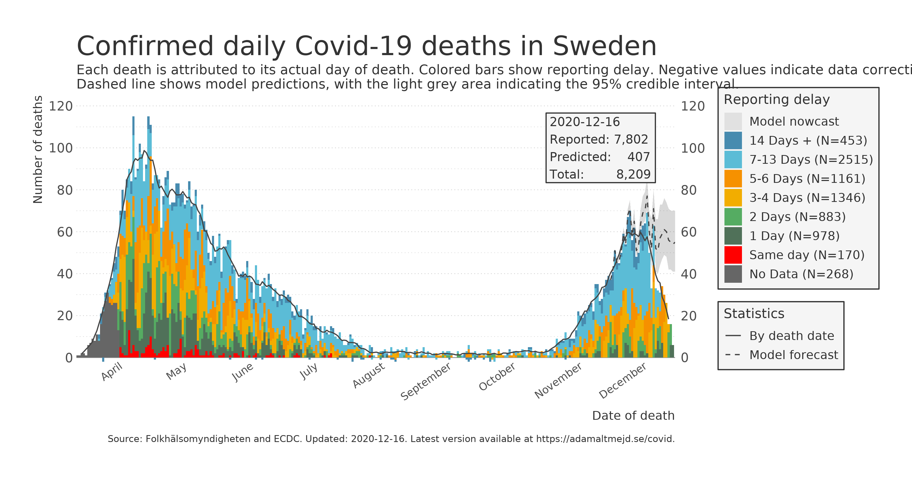
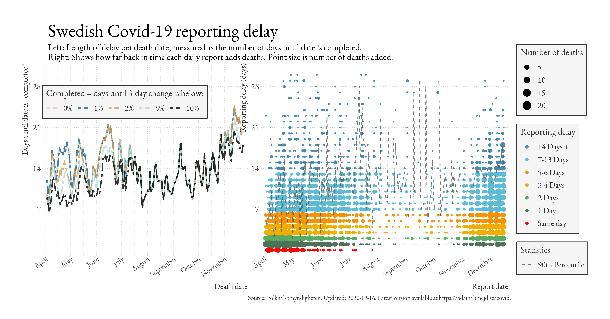
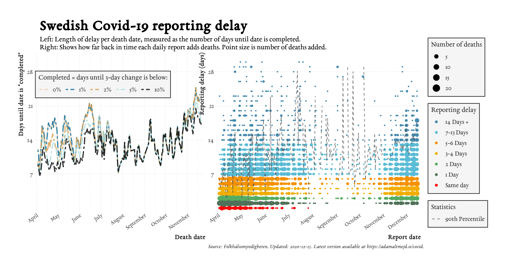

=======
date: 2020-12-15
---

>>>>>>> a990f8dabd63d0183214ad888058ced93bb42d9a
For code and data, visit <https://github.com/adamaltmejd/covid>.
For an indepth explanation and evaluation of the nowcasting model, see <https://arxiv.org/abs/2006.06840>.
