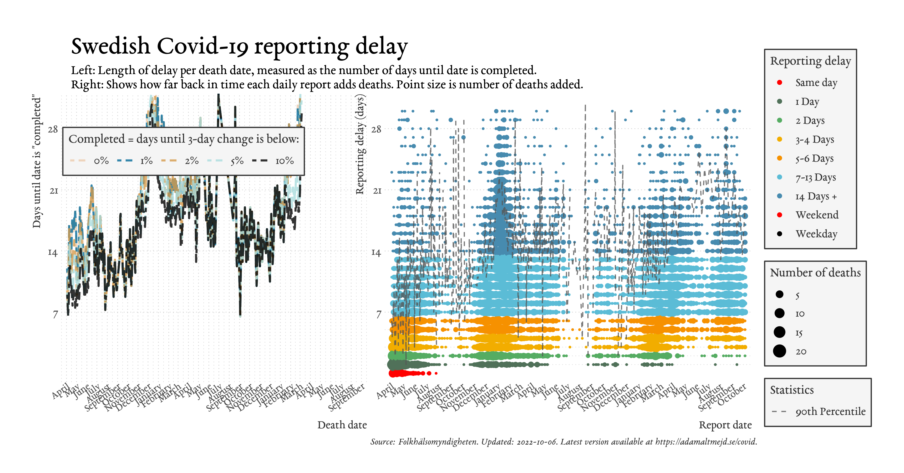

For code and data, visit <https://github.com/adamaltmejd/covid>.
Evaluations of the statistical model and the old constant average forecast are available here: <https://github.com/adamaltmejd/covid/tree/master/docs/eval>.
For an indepth explanation and evaluation of the nowcasting model, see <https://arxiv.org/abs/2006.06840>.
